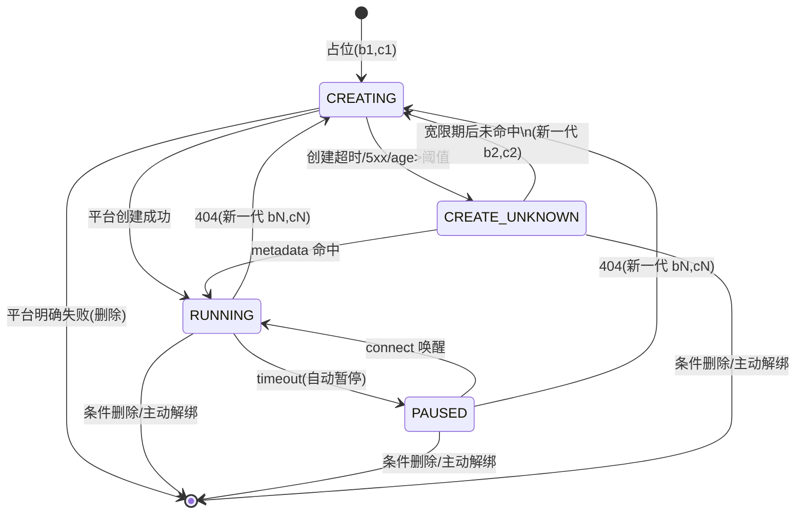

## 四、沙箱生命周期

沙箱平台对齐 E2B 协议。核心模型：按需创建、超时自动暂停（autoPause）、再次访问时唤醒（connect）。不做热池。

这套生命周期设计基于以下背景约束：

- 面向 C 端高流量场景，用户规模目标是千万到亿级，不能为冷用户长期维持运行态实例，也不希望引入复杂的热池维护体系。
- 用户与沙箱是 1:1 关系，优先保证“下次进来还能回到自己的环境”，而不是 session 级临时隔离。
- 当前平台创建沙箱速度足够快，因此新用户路径直接创建即可，没必要为了首期方案额外引入 warm pool。
- 平台具备 `autoPause`、`connect` 和自动 GC 能力，但暂停时不会回调业务侧，所以 PAUSED 只能在用户下次访问时懒发现。
- 平台不提供幂等创建能力，且 `connect` 的耗时约 10 秒，因此业务侧必须同时解决并发创建、重复唤醒和创建结果未知三类问题。首期采用“`MySQL` 保存绑定真相 + 用户级分布式锁串行化慢操作”的混合方案。
- 统一重试策略：请求在等待锁释放或等待状态推进时，采用指数退避重试（初始间隔 200ms、翻倍增长、上限 2s、加随机 jitter），单次请求内累计重试等待不超过 15s。超过后返回 503（服务繁忙），不继续阻塞。各参数可按压测结果调整。
- CREATING 僵尸恢复：如果路由发现 `CREATING` 状态的 `created_at` 距今超过恢复阈值（默认 60s，应 ≥ 2 倍锁租约上限），视为创建者可能已崩溃，当前请求可尝试抢锁接管并 CAS 转为 `CREATE_UNKNOWN` 恢复，不再仅依赖定时任务兜底。
- 单次工具调用统一硬超时 300s。sandbox 默认 900s（15 分钟）的 timeout 只用于实例空闲自动暂停，不代表单次命令可执行 900s；因此服务端在调用前执行 `ensure_active` 即可覆盖正常调用过程，不额外引入 heartbeat。

下面的状态机、路由、状态存储和定时任务设计，都是围绕这些约束展开的。

### 4.1 状态机

```
(none) --占位(b1,c1)--> CREATING --平台创建成功--> RUNNING --timeout--> PAUSED --connect--> RUNNING
                          |                             ^                                       |
                          |--创建超时/5xx/age>阈值--> CREATE_UNKNOWN --metadata 命中-----------+
                          |                             |
                          |                             +--超过宽限期仍未命中--> CREATING(新一代 b2,c2)
 RUNNING / PAUSED --404/not found----------------------------------------------> CREATING(新一代 bN,cN)
 任意当前代 --条件删除/主动解绑-------------------------------------------------> DESTROYED
```

等价的 Mermaid 图（便于渲染）：



| 状态           | 含义                                               | E2B 对应                 |
| -------------- | -------------------------------------------------- | ------------------------ |
| CREATING       | 当前 generation 已占位，正在调用平台创建沙箱       | 尚未创建                 |
| CREATE_UNKNOWN | 创建请求返回超时/5xx/网络异常，或 CREATING 超过恢复阈值被接管，平台结果未知 | 需靠 metadata 恢复 |
| RUNNING        | 实例运行中，可接受工具调用                         | sandbox 处于活跃状态     |
| PAUSED         | 超时后自动暂停，进程冻结、数据保留                 | `autoPause: true` 触发   |
| DESTROYED      | 实例销毁，数据丢失                                 | `DELETE /sandboxes/{id}` |

引入两个 token：

- `binding_token`：当前绑定 generation 的版本号。每次进入新一代创建都换新值，所有写 DB 的操作都必须带上它做 CAS 条件。
- `create_token`：当前创建尝试 ID。写入平台 sandbox metadata，用来在 `CREATE_UNKNOWN` 状态下恢复那次不确定的创建结果。

再引入一把用户级生命周期锁：

- `lifecycle_lock`：用户级分布式锁，key 形如 `sandbox:lifecycle:{userid}`。凡是 `create`、`connect`、`CREATE_UNKNOWN` 恢复、404 后重建、后台修复任务这类会调用平台 API 的慢操作，都先抢这把锁。
- 不单独引入 `CONNECTING` 状态。`connect` 虽然大约要 10 秒，但通过用户级锁保证同一时刻只有一个请求真正去唤醒；DB 只记录持久业务状态，不额外记录一个短暂的唤醒中间态。

### 4.2 沙箱分配与路由

#### 4.2.1 分配流程

用户请求进来时的路由逻辑：

```
用户请求 → 查 DB: SELECT * FROM sandbox_binding WHERE userid=?
       |
       +→ 无记录 → 新用户，走创建流程
       |
       +→ 有记录 → 看 state
                |
                +→ CREATING → 检查 created_at 是否超过恢复阈值(60s)
                |             |
                |             +→ 未超过 → 指数退避重试查询（累计上限 15s），超限返回 503
                |             +→ 已超过 → 先尝试获取 lifecycle lock
                |                        |
                |                        +→ 拿锁成功 → 锁后重查 DB，若仍为陈旧 CREATING 则 CAS 转 CREATE_UNKNOWN，再走路径 B 步骤 3
                |                        +→ 未拿到锁 → 指数退避重试查询（累计上限 15s），超限返回 503
                |
                +→ CREATE_UNKNOWN → 先尝试获取 lifecycle lock
                |                  |
                |                  +→ 拿锁成功 → 锁后重查 DB，再按 metadata(create_token) 恢复
                |                  +→ 未拿到锁 → 指数退避重试查询（累计上限 15s），超限返回 503
                |
                +→ RUNNING/PAUSED  → 先执行 ensure_active
                                   |
                                   +→ timeout 成功        → 继续执行工具调用
                                   +→ 返回已暂停/404      → 先尝试获取 lifecycle lock
                                   |                       |
                                   |                       +→ 拿锁成功 → 锁后重查 DB，再执行 connect 或重建
                                   |                       +→ 未拿到锁 → 指数退避重试查询（累计上限 15s），超限返回 503
                                   +→ 返回超时/5xx        → 保留记录，返回 503（由调用方按自身策略重试）
```

所有会调用平台 API 的慢操作都必须遵守两个原则：

- 先拿用户级 `lifecycle_lock`，没拿到锁就不要直接打平台。
- 拿锁后必须重新 `SELECT` 当前用户的绑定记录，基于最新状态决定是否还要继续执行平台调用。

所有写 DB 的操作都必须带上当前 generation 条件：

- 只改当前绑定代：`userid + binding_token`
- 改当前已绑定实例：`userid + sandbox_id + binding_token`
- 回写当前创建结果：`userid + binding_token + create_token`

SQL 影响 `0` 行表示当前请求拿到的是旧结果，必须放弃当前结果并重新查 DB，不能继续删改绑定。

四条路径的具体操作：

**路径 A：新用户创建**

1. 先获取用户级生命周期锁 `sandbox:lifecycle:{userid}`。未拿到锁说明已有请求正在创建或恢复，按指数退避重试查询（累计上限 15s），超限返回 503。
2. 拿锁后重新 `SELECT`。如果此时已存在记录，说明别的请求已经推进状态，当前请求释放锁并按最新 state 处理。
3. 生成一组新 token：`binding_token=b1`，`create_token=c1`。
4. 再 INSERT 占位行，DB 主键作为兜底防重：

```sql
INSERT INTO sandbox_binding (userid, sandbox_id, state, binding_token, create_token, template_version, first_bound_at, created_at, last_active)
VALUES ('{userid}', NULL, 'CREATING', '{binding_token}', '{create_token}', '{current_version}', {now}, {now}, {now});
```

- INSERT 成功 → 拿到当前 generation 的创建权，继续下一步。
- 主键冲突 → 说明锁切换窗口内已有记录写入，当前请求释放锁并重查 DB。

5. 调用沙箱平台创建接口，并把 token 写入 metadata：

```
POST /sandboxes
{
  "templateID": "skill-agent",
  "autoPause": true,
  "timeout": 900,
  "metadata": {
    "userid": "{userid}",
    "binding_token": "{binding_token}",
    "create_token": "{create_token}"
  }
}
```

6. 创建成功 → 条件 UPDATE 当前 generation，占位行写入真实 sandbox_id 并置状态为 RUNNING：

```sql
UPDATE sandbox_binding
SET sandbox_id='{sandbox_id}', state='RUNNING', last_active={now}
WHERE userid='{userid}'
  AND state='CREATING'
  AND sandbox_id IS NULL
  AND binding_token='{binding_token}'
  AND create_token='{create_token}';
```

7. UPDATE 影响 1 行 → 创建完成，释放锁，返回 sandbox 连接信息。
8. UPDATE 影响 0 行 → 说明当前结果已经过期（例如这一代已被清理或被新 generation 替换），当前请求释放锁并直接放弃，不继续使用这个 sandbox。若平台侧实际已创建成功，该实例后续由 metadata 对账或平台 GC 回收。
9. 平台明确创建失败（明确 4xx/业务失败）→ 条件 DELETE 占位行，释放创建权：

```sql
DELETE FROM sandbox_binding
WHERE userid='{userid}'
  AND state='CREATING'
  AND sandbox_id IS NULL
  AND binding_token='{binding_token}'
  AND create_token='{create_token}';
```

DELETE 影响 0 行说明当前 generation 已被其他请求推进或清理，直接忽略即可——无论是否删除成功，都释放锁。

10. 平台返回超时、5xx、网络断开等不确定结果 → 不删除占位，转为 `CREATE_UNKNOWN`：

```sql
UPDATE sandbox_binding
SET state='CREATE_UNKNOWN'
WHERE userid='{userid}'
  AND state='CREATING'
  AND sandbox_id IS NULL
  AND binding_token='{binding_token}'
  AND create_token='{create_token}';
```

11. 无论成功、明确失败还是转入 `CREATE_UNKNOWN`，都在完成对应 DB 回写后释放锁。

**路径 B：CREATE_UNKNOWN 恢复（含陈旧 CREATING 接管）**

> 陈旧 CREATING 的接管也进入本路径。当路由发现 CREATING 的 `created_at` 超过恢复阈值（60s），持锁后先 CAS 转为 `CREATE_UNKNOWN`（`UPDATE ... SET state='CREATE_UNKNOWN' WHERE userid=? AND state='CREATING' AND sandbox_id IS NULL AND binding_token=? AND create_token=?`，影响 0 行则说明状态已被其他请求推进，释放锁并重查 DB），然后直接从步骤 3 开始执行 metadata 恢复。

1. 先获取用户级生命周期锁 `sandbox:lifecycle:{userid}`。未拿到锁则按指数退避重试查询（累计上限 15s），超限返回 503。
2. 拿锁后重新 `SELECT`。如果当前 state 已不再是 `CREATE_UNKNOWN`，或者 `binding_token / create_token` 已变化，说明别的请求已经处理过这一代，当前请求释放锁并按最新 state 处理。
3. 再按 `userid + create_token` 向平台查询 metadata，对应这一代不确定创建：

```
GET /sandboxes?metadata=userid%3D{userid}%26create_token%3D{create_token}
```

4. 命中 1 个实例 → 条件 UPDATE 当前 generation，补写 `sandbox_id` 并转为 RUNNING：

```sql
UPDATE sandbox_binding
SET sandbox_id='{sandbox_id}', state='RUNNING', last_active={now}
WHERE userid='{userid}'
  AND state='CREATE_UNKNOWN'
  AND binding_token='{binding_token}'
  AND create_token='{create_token}';
```

5. 命中多个实例 → 按确定性规则选 1 个实例绑定（建议固定按 `sandbox_id` 字典序最小者，保证同一组 metadata 多次查询的选取结果稳定，便于排障），其余实例异步回收并告警。命中多个实例本身是异常信号（平台 create 非幂等、metadata 索引异常等），应作为重点告警排查项。
6. 未命中且仍在恢复宽限期内 → 保留 `CREATE_UNKNOWN`，释放锁后直接返回重试，不新建。
7. 未命中且超过宽限期 → 开启新一代创建。先生成 `binding_token=b2`、`create_token=c2`，然后 CAS 把当前 generation 旋转到新一代：

```sql
UPDATE sandbox_binding
SET state='CREATING',
    sandbox_id=NULL,
    binding_token='{new_binding_token}',
    create_token='{new_create_token}',
    created_at={now},
    last_active={now}
WHERE userid='{userid}'
  AND state='CREATE_UNKNOWN'
  AND binding_token='{old_binding_token}'
  AND create_token='{old_create_token}';
```

8. UPDATE 影响 1 行 → 当前请求保持锁，直接继续调用平台创建接口；不需要释放锁后二次抢锁。
9. UPDATE 影响 0 行 → 说明别的请求或定时任务已经处理过这一代，当前请求释放锁并重新查 DB。

**路径 C：ensure_active（已有绑定实例）**

1. 在真正执行工具调用前，先调用 `POST /sandboxes/{sandbox_id}/timeout`：

```json
{ "timeout": 900 }
```

2. `/timeout` 成功 → 说明 sandbox 仍为 RUNNING，同时完成续期；用 `userid + sandbox_id + binding_token` 条件 UPDATE `last_active`，继续执行工具调用。这个分支不需要拿分布式锁。**注意：如果 DB 当前 state 为 PAUSED 但 `/timeout` 返回成功，说明平台实际已处于 RUNNING（可能是之前 `connect` 成功但回写未落库的遗留），此时必须在更新 `last_active` 的同时把 state 修正为 RUNNING（`UPDATE ... SET state='RUNNING', last_active={now} WHERE userid=? AND sandbox_id=? AND binding_token=? AND state IN ('PAUSED','RUNNING')`）。这是 `PAUSED` 侧的关键自愈闭环——如果不做这个修正，DB 会长期保持陈旧的 PAUSED，后续请求会反复误走唤醒慢路径。**
3. `/timeout` 返回"沙箱已暂停" → 先获取用户级生命周期锁。未拿到锁则按指数退避重试查询（累计上限 15s），超限返回 503。
4. 拿锁后重新 `SELECT`。如果当前 generation 已变化，或别的请求已经把状态推进到 RUNNING / CREATING / CREATE_UNKNOWN，则当前请求释放锁并按最新 state 处理。
5. 如果锁后重查仍然确认当前 sandbox 处于 PAUSED / RUNNING 且 `sandbox_id + binding_token` 未变，则先尝试把当前 generation 标记为 PAUSED，再调用 `POST /sandboxes/{sandbox_id}/connect`。由于 `connect` 约 10 秒，通过锁保证同一时刻只有一个请求真的去唤醒。
6. `connect` 成功 → 用 `userid + sandbox_id + binding_token` 条件 UPDATE DB 为 RUNNING，刷新 `last_active`，释放锁后继续执行工具调用。
7. `connect` 或 `/timeout` 明确返回 404 / not found → 说明当前实例失效。此时不能盲删整行，而是生成新一代 token，CAS 把当前 generation 旋转到新的 `CREATING`：

```sql
UPDATE sandbox_binding
SET state='CREATING',
    sandbox_id=NULL,
    binding_token='{new_binding_token}',
    create_token='{new_create_token}',
    created_at={now},
    last_active={now}
WHERE userid='{userid}'
  AND sandbox_id='{old_sandbox_id}'
  AND binding_token='{old_binding_token}'
  AND state IN ('RUNNING', 'PAUSED');
```

8. UPDATE 影响 1 行 → 当前请求保持锁，继续走平台创建步骤。
9. UPDATE 影响 0 行 → 说明这条记录已经被别的请求推进到新 generation，当前请求释放锁并重新查 DB。
10. `/timeout` 或 `connect` 返回超时、5xx 等不确定错误 → 保留记录，释放锁后直接返回重试，不触发重建。

**路径 D：执行工具调用**

`ensure_active` 成功后，再对 sandbox 执行实际工具调用，使用的是当前请求刚刚确认过的 `sandbox_id + binding_token` 视图。

如果工具调用阶段仍然明确返回"沙箱已暂停"，说明 `ensure_active` 与实际执行之间出现了短暂竞态，此时就地再走一次路径 C；如果明确返回 404 / not found，则按路径 C 的方式 CAS 切到新一代创建；若是超时、5xx 等不确定错误，则保留记录并返回重试。

关于执行阶段的竞态重试，需要区分工具类型：
- **只读工具**（Read）或**幂等操作**：竞态后重走路径 C 再重新执行是安全的。
- **非幂等工具**（Write、Edit、Bash）：如果执行阶段返回"已暂停"或 404，说明命令可能已经部分执行。此时重走路径 C 修复生命周期（唤醒或重建）是必须的，但**不应默认对原始工具调用做透明重试**——非幂等命令可能已经写了一半文件、改了一半环境或发了外部请求，自动重试会产生重复副作用。正确做法是：修复完生命周期后，将"工具调用失败 + 可能已部分执行"的语义返回给上层（Agent / 调用方），由上层决定是否重试。

#### 4.2.2 超时续期

每次用户与沙箱交互（工具调用、文件操作等）前，服务端都先执行一次 `ensure_active`。它只处理已经拿到 `sandbox_id` 的 `RUNNING / PAUSED` 实例，目标是两件事：

1. 如果实例仍在 RUNNING，就先续期。
2. 如果实例已经 PAUSED，就先唤醒。

`ensure_active` 的第一步是调用：

```
POST /sandboxes/{sandbox_id}/timeout
{ "timeout": 900 }
```

如果 `/timeout` 成功，说明实例仍在 RUNNING，并且超时时间被重置。若返回"沙箱已暂停"，则先获取用户级 `lifecycle_lock`，锁后重查 DB，再由持锁请求调用 `POST /sandboxes/{sandbox_id}/connect` 唤醒。也就是说，续期和唤醒统一在 `ensure_active` 里完成。`CREATE_UNKNOWN` 不走 `ensure_active`，而是先走路径 B 的 metadata 恢复。

单次工具调用的服务端硬超时固定为 `300s`，而 sandbox 的超时时间默认是 `900s`（15 分钟）。前者是单次调用上限，后者是实例空闲自动暂停倒计时，两者语义不同。因此只要在调用前成功执行一次 `ensure_active`，对于不超过 `300s` 的正常调用，执行过程中不会因为实例 timeout 而 autoPause，不需要额外的 heartbeat 续期机制。

用户停止交互后，最后一次 `ensure_active` 开始倒计时，到期后平台自动 autoPause。

首期不支持超过 `300s` 的长任务、detach 任务或后台任务；如果未来要支持，再单独设计作业模型和执行中的 heartbeat 机制。

**300s 硬超时后的副作用**：服务端到达 300s 硬超时后，会切断与 sandbox 的连接并向调用方返回超时错误，但 sandbox 内已经启动的进程（如 `bash` 中的编译任务、`apt install` 等）不会被自动终止——它们会以"幽灵进程"的形式继续运行，直到完成或 sandbox 因空闲超时被 autoPause。这意味着下次请求进入同一个 sandbox 时，上一次超时的命令可能仍在运行，文件系统可能处于不一致状态。首期不主动治理此类残留，Agent 自身需具备检查上下文是否符合预期的能力（如 `ls`、`ps` 等）。

超时时间可配置，默认 900s（15 分钟）。

由于 `connect` 的耗时大约是 10 秒，分布式锁等待时间、metadata 恢复时间和 `connect` 时间都计入这次请求的 `300s` 总预算。也就是说，真正留给工具调用本身的执行预算是 `300s - 锁等待 - 恢复/唤醒耗时`。如果剩余预算已经不足，服务应直接返回重试或超时，而不是再启动新的工具调用。

#### 4.2.3 用户级分布式锁

生命周期相关的慢操作统一通过用户级分布式锁串行化，推荐实现：

- 锁 key：`sandbox:lifecycle:{userid}`
- 典型实现：Redis `SET NX PX`、Redisson 或同类具备自动续租能力的组件
- 锁租约：建议 `30s-60s`，至少覆盖 `connect≈10s` 和 create 的 p99；如果 create 可能更长，必须支持续租 / watchdog

这把锁只用于**慢操作**：

- 首次创建
- `CREATE_UNKNOWN` 恢复
- `PAUSED -> connect` 唤醒
- 404 / not found 后切换到新 generation 并重建
- 对账、恢复、僵尸清理等后台修复任务

这把锁**不用于**：

- `/timeout` 成功后的常规续期
- 普通 Read / Write / Edit / Bash 工具调用

使用原则：

1. 先拿锁，再重查 DB，最后才调用平台 API。
2. 没拿到锁时，不要直接打平台，短暂等待后重试查询即可。
3. 锁只解决“同一时刻谁去 create / connect / recover”，不解决旧结果晚回来误写当前绑定的问题，因此 DB 回写仍然必须带 `binding_token + create_token` 做 CAS。

### 4.3 状态存储（MySQL）

用户与沙箱的绑定关系存储在 MySQL 中。相比 Redis，MySQL 在亿级用户规模下的优势：事务原子性天然支持、磁盘存储成本低、按 userid 分库分表方案成熟、条件查询走索引不需要全表扫描。

#### 4.3.1 表结构

```sql
CREATE TABLE sandbox_binding (
  id                BIGINT       NOT NULL AUTO_INCREMENT,
  userid            BIGINT       NOT NULL,
  sandbox_id        VARCHAR(64)  DEFAULT NULL,
  envd_access_token TEXT         DEFAULT NULL,
  state             ENUM('CREATING', 'CREATE_UNKNOWN', 'RUNNING', 'PAUSED') NOT NULL DEFAULT 'CREATING',
  binding_token     VARCHAR(64)  NOT NULL,
  create_token      VARCHAR(64)  NOT NULL,
  template_version  VARCHAR(32)  NOT NULL,
  first_bound_at    DATETIME(3)  NOT NULL,
  created_at        DATETIME(3)  NOT NULL,
  last_active       DATETIME(3)  NOT NULL,
  PRIMARY KEY (id),
  UNIQUE KEY uk_userid (userid),
  UNIQUE KEY uk_sandbox_id (sandbox_id)
) ENGINE=InnoDB DEFAULT CHARSET=utf8mb4;
```

设计要点：

- `id` 自增主键，InnoDB 聚簇索引顺序写入，避免 VARCHAR 主键的页分裂。`userid` 加唯一索引保证 1:1 约束，同时也是查询的唯一入口。
- `binding_token` 表示当前绑定 generation。任何 UPDATE / DELETE 都必须带上它，旧请求拿着旧 token 回来时只能影响 0 行，不能误删误改新绑定。
- `create_token` 表示当前创建尝试，写入平台 metadata，用来恢复 `CREATE_UNKNOWN`。
- `envd_access_token` 是 E2B 平台在创建沙箱时下发的访问令牌，用于连接 sandbox 内部的 envd 服务（文件操作、命令执行等）。与 `sandbox_id` 同生命周期：创建成功时一起写入，generation 旋转时随 `sandbox_id` 一起置空，`CREATE_UNKNOWN` 恢复绑定时一起补写。用 `TEXT` 类型是因为 token 长度不固定且可能较长。
- `sandbox_id` 加唯一索引，防止同一个沙箱被绑到两个用户。`CREATING / CREATE_UNKNOWN` 状态时允许为 `NULL`。
- `CREATING` 用于占位并持有创建权，`CREATE_UNKNOWN` 用于承接创建结果不确定的状态。
- `template_version` 记录当前绑定沙箱使用的模板版本号。INSERT 时写入当前最新版本，generation 旋转时更新为最新版本。服务层可在 `ensure_active` 时比较 DB 中的版本与当前最新版本，版本落后时触发强制重建。首期不实现自动升级，仅记录版本供排查和未来扩展。
- `first_bound_at` 记录用户首次绑定沙箱的时间（`DATETIME(3)`，毫秒精度），仅在 INSERT 时设置，generation 旋转（UPDATE）时不更新。用于运营统计和计费等需要"用户首次使用时间"的场景。
- `created_at` 表示**当前 generation** 的创建时间（`DATETIME(3)`），不是用户首次绑定时间。generation 旋转时会被重置为当前时间，用于 CREATING 僵尸恢复的阈值判断（`created_at < DATE_SUB(NOW(), INTERVAL 60 SECOND)`）。与 `first_bound_at` 语义不同，不要混淆。
- `last_active` 记录最近一次成功交互的时间（`DATETIME(3)`），用于对账和运营统计。
- 不存 DESTROYED 状态——沙箱销毁后直接删行，不留历史记录。
- 亿级用户时按 `userid` 哈希分库分表，每个用户的所有操作都在同一个分片内完成。分库分表后自增 `id` 只在分片内唯一，全局唯一性由 `uk_userid` 保证。

#### 4.3.2 创建绑定

创建流程的关键写入（对应 4.2.1 路径 A 和路径 B）：

```sql
-- 第一步：占位
INSERT INTO sandbox_binding (userid, sandbox_id, state, binding_token, create_token, template_version, first_bound_at, created_at, last_active)
VALUES ('{userid}', NULL, 'CREATING', '{binding_token}', '{create_token}', '{current_version}', {now}, {now}, {now});

-- 第二步：平台创建成功后，更新为正式绑定
UPDATE sandbox_binding
SET sandbox_id='{sandbox_id}', state='RUNNING', last_active={now}
WHERE userid='{userid}'
  AND state='CREATING'
  AND sandbox_id IS NULL
  AND binding_token='{binding_token}'
  AND create_token='{create_token}';

-- 第三步：创建结果未知时，转为 CREATE_UNKNOWN
UPDATE sandbox_binding
SET state='CREATE_UNKNOWN'
WHERE userid='{userid}'
  AND state='CREATING'
  AND sandbox_id IS NULL
  AND binding_token='{binding_token}'
  AND create_token='{create_token}';
```

唯一键约束（`uk_userid`）保证同一用户只有一个请求能把“空记录”首次插进去，起到兜底防重的作用；真正的 create / connect / recover 串行化交给用户级分布式锁。`binding_token + create_token` 则继续负责最后一道 CAS 保护：即使锁持有者超时、旧请求晚回来、后台任务拿着旧快照，凡不是当前 generation 的结果都只能影响 0 行。

> **关于 `template_version` 和 `first_bound_at`**：以上 SQL 示例省略了这两个字段以突出核心逻辑。实际实现中，所有 INSERT 必须写入 `template_version`（当前最新版本）和 `first_bound_at`（当前时间）；所有 generation 旋转的 UPDATE（`CREATE_UNKNOWN → CREATING`、`RUNNING/PAUSED → CREATING`）必须更新 `template_version` 为最新版本，但**不更新** `first_bound_at`。

#### 4.3.3 状态流转操作

下表只描述最终落到 MySQL 的状态变化。凡是 `create`、`connect`、`CREATE_UNKNOWN` 恢复、404 后重建这类会调用平台 API 的流转，都要求先持有用户级 `lifecycle_lock`，并在持锁后重查一次 DB。

| 流转                         | 触发时机                               | SQL |
| ---------------------------- | -------------------------------------- | --- |
| (无) → CREATING             | 新用户，占位                           | `INSERT INTO sandbox_binding (..., NULL, 'CREATING', binding_token=?, create_token=?, ...)` |
| CREATING → RUNNING          | 平台创建成功且确认是当前 generation     | `UPDATE ... SET sandbox_id=?, state='RUNNING' WHERE userid=? AND state='CREATING' AND sandbox_id IS NULL AND binding_token=? AND create_token=?` |
| CREATING → CREATE_UNKNOWN   | ① 创建超时 / 5xx / 网络中断；② 后续请求发现 CREATING 超过恢复阈值（60s），持锁后 CAS 接管 | `UPDATE ... SET state='CREATE_UNKNOWN' WHERE userid=? AND state='CREATING' AND sandbox_id IS NULL AND binding_token=? AND create_token=?` |
| CREATE_UNKNOWN → RUNNING    | metadata 查询命中当前创建实例           | `UPDATE ... SET sandbox_id=?, state='RUNNING', last_active=? WHERE userid=? AND state='CREATE_UNKNOWN' AND binding_token=? AND create_token=?` |
| CREATE_UNKNOWN → CREATING   | 宽限期后仍未命中，开启新 generation     | `UPDATE ... SET state='CREATING', sandbox_id=NULL, binding_token=?, create_token=?, created_at=?, last_active=? WHERE userid=? AND state='CREATE_UNKNOWN' AND binding_token=? AND create_token=?` |
| RUNNING → PAUSED            | `/timeout` 返回已暂停                   | `UPDATE ... SET state='PAUSED' WHERE userid=? AND sandbox_id=? AND binding_token=? AND state='RUNNING'` |
| PAUSED → RUNNING            | `connect` 成功                          | `UPDATE ... SET state='RUNNING', last_active=? WHERE userid=? AND sandbox_id=? AND binding_token=? AND state IN ('PAUSED','RUNNING')` |
| PAUSED → RUNNING（自愈）    | DB 为 PAUSED 但 `/timeout` 返回成功（平台实际已 RUNNING，前次 connect 回写未落库） | `UPDATE ... SET state='RUNNING', last_active=? WHERE userid=? AND sandbox_id=? AND binding_token=? AND state='PAUSED'`（路径 C 步骤 2，不需要锁） |
| RUNNING / PAUSED → CREATING | `ensure_active` 或工具调用明确返回 404  | `UPDATE ... SET state='CREATING', sandbox_id=NULL, binding_token=?, create_token=?, created_at=?, last_active=? WHERE userid=? AND sandbox_id=? AND binding_token=? AND state IN ('RUNNING','PAUSED')` |
| CREATING → 删除             | 平台明确创建失败                        | `DELETE FROM sandbox_binding WHERE userid=? AND state='CREATING' AND sandbox_id IS NULL AND binding_token=? AND create_token=?` |
| \* → 删除                   | 对账确认当前 generation 已失效或主动解绑 | `DELETE FROM sandbox_binding WHERE userid=? AND binding_token=? [AND sandbox_id=?]` |

关于 RUNNING → PAUSED 的发现机制：沙箱平台超时后自动暂停，不会回调我们的服务。DB 里的状态仍然可能还是 RUNNING。实际发现发生在用户下次请求时——在真正执行工具调用前，服务端先调用 `/timeout` 做 `ensure_active`。如果返回"沙箱已暂停"，则：

1. 尝试用 `userid + sandbox_id + binding_token` 把当前 generation 更新为 PAUSED。
2. 在持有用户级 `lifecycle_lock` 的前提下，调用 `POST /sandboxes/{id}/connect` 唤醒。
3. 唤醒成功后再用同一组条件把当前 generation 更新回 RUNNING，并继续执行原始工具调用。

`CREATE_UNKNOWN` 也是**懒恢复**的——只有后续请求或定时任务真正触碰到这一行时，才会去平台按 metadata 恢复。无论是 `PAUSED` 还是 `CREATE_UNKNOWN`，所有恢复动作都必须命中当前 generation，影响 0 行就说明自己拿的是旧结果。

**关于 CONNECTING 中间态**：当前设计在 `connect` 期间不引入额外的 `CONNECTING` 中间状态，而是复用 PAUSED + `lifecycle_lock` 保护。原因是 `connect` 被分布式锁串行化，同一时刻只有一个请求在唤醒，锁后重查机制保证其他请求不会对同一实例重复 `connect`；引入 `CONNECTING` 不带来额外安全收益，反而增加状态机复杂度和需要额外处理 `CONNECTING` 僵尸恢复。如果将来 `connect` 耗时显著增大或需要支持旁路可观测（如监控面板展示唤醒中状态），再考虑加入。

#### 4.3.4 并发与容错

**慢操作串行化**：同一用户的 `create`、`connect`、`CREATE_UNKNOWN` 恢复（含陈旧 CREATING 接管）、404 后重建共用一把 `sandbox:lifecycle:{userid}` 分布式锁。这样多个并发请求不会同时打平台创建或同时唤醒同一台 paused sandbox。

**锁后重查**：拿到锁只代表获得了“处理资格”，不代表刚才读到的 DB 快照还有效。任何持锁请求在真正调用平台 API 前，都必须重新 `SELECT` 当前用户绑定，基于最新 state 和 token 决定是否继续。

**旧结果防误写**：所有 UPDATE / DELETE 都必须带 `binding_token`，创建结果回写还必须带 `create_token`。这样旧请求即使晚回来，也只能影响 0 行，不能把新 generation 的绑定删掉或写坏。

**创建结果未知恢复**：平台创建返回超时、5xx、网络断开时，不立即删占位，也不立刻再建，而是先转成 `CREATE_UNKNOWN`。如果创建者进程崩溃导致状态停留在 `CREATING` 超过恢复阈值（60s），后续请求在持锁后也会 CAS 转为 `CREATE_UNKNOWN`。无论哪种来源，后续请求和定时任务都必须先按 `create_token` 查平台 metadata，尽量把那次不确定创建恢复回来。

**映射泄漏防护**：可能出现 DB 有记录但平台实例已不存在的情况（平台异常回收、人工删除等）。防护机制：

- 请求路由时，如果 `ensure_active`（`/timeout` 或 `/connect`）或工具调用明确返回 404 / 实例不存在，不是盲删整行，而是在持锁前提下，只在当前 generation 上 CAS 切到新一代 `CREATING`。
- 如果返回超时、5xx、网络抖动等不确定错误，则保留 DB 记录并返回重试。
- 定时对账任务（见 4.4）补捕漏网。

**DB 故障处理**：DB 是用户级 1:1 绑定的真实来源。DB 不可用时，服务直接返回重试，不降级为"直接调用平台创建新实例"；否则在并发场景下无法保证一个用户只对应一个当前 generation。

**Redis 故障处理**：分布式锁依赖 Redis。Redis 不可用时，所有需要锁的操作（创建、唤醒、恢复、重建）直接返回 503，不降级为无锁执行——无锁状态下并发请求可能同时创建多个沙箱或同时唤醒同一实例，破坏 1:1 绑定语义。已有 RUNNING 沙箱的正常工具调用不受影响（`/timeout` 续期和工具执行不需要锁）；但一旦沙箱 autoPause 后，在 Redis 恢复前无法唤醒。

**创建显式失败的死循环防护**：如果平台 `create` 明确返回 4xx 业务错误（如配额用尽、模板不存在），当前设计会执行"DELETE 占位 → 下次请求重新 INSERT CREATING → 再调 create → 再失败 → 再删除……"，形成无意义重试循环。防护措施：对于平台明确返回的业务类错误（非临时性故障），应在 DELETE 占位后附带一次冷却标记（如 Redis key `sandbox:create_cooldown:{userid}`，TTL 30s-60s），冷却期内直接返回错误信息，不再尝试创建。具体冷却时间可按线上表现调整。

**并发初始请求的 singleflight 优化（非首期）**：当前设计下，新用户并发 N 个请求时，只有一个请求持锁创建，其余 N-1 个请求各自在指数退避中重试轮询 DB，等到创建完成后才能执行。首期这种方式可以接受。后续如果并发量大，可以考虑在服务层引入 singleflight 机制：持锁请求创建完成后广播结果，等待中的请求直接拿到结果继续，避免多次 DB 轮询。

### 4.4 定时任务

定时任务两个：

| 任务         | 周期    | 逻辑                                                                                                                                 |
| ------------ | ------- | ------------------------------------------------------------------------------------------------------------------------------------ |
| 对账清理         | 每 5min | 分片并行扫描 `sandbox_binding` 表中 state 为 RUNNING 或 PAUSED 的记录。处理某个 `userid` 前，先尝试获取同一把 `lifecycle_lock`；拿到锁后重查 DB，再向平台查询实例状态。平台明确返回"不存在"→ 只按 `userid + sandbox_id + binding_token` 条件删除当前 generation；平台返回超时、5xx 等不确定错误 → 跳过该条记录，保留 DB 状态，留待下次对账 |
| 创建恢复 / 僵尸清理 | 每 1min | 扫描 `CREATING` 和 `CREATE_UNKNOWN` 且 `created_at` 距今超过配置阈值的行。处理某个 `userid` 前同样先拿 `lifecycle_lock`，拿锁后重查 DB 再按 `create_token` 查询平台 metadata；命中 1 个实例 → CAS 绑定为 RUNNING；命中多个 → 选 1 个绑定，其余异步回收并告警；命中 0 个且超过阈值 → 只按 `userid + binding_token + create_token` 删除当前 generation，释放创建权，等待下次请求再创建 |

对账任务按分片并行执行，每个分片的 worker 只扫描自己负责的数据，避免全局串行瓶颈。前台请求和后台 worker 共用同一把用户级生命周期锁：锁忙时后台任务直接跳过该用户，留待下一轮；无论是谁持锁，只要不是当前 generation，所有 DB 写操作都只能影响 0 行。实际批量大小、并发度和完成周期以线上压测结果为准。

服务层不主动回收暂停沙箱。PAUSED 状态下沙箱数据原地保留，用户随时可以 connect 唤醒继续使用。平台会对长期未使用或未绑定的 sandbox 执行自动 GC；一旦平台回收了实例，对账任务再清理对应的 DB 记录。

### 4.5 完整请求时序

一次典型的用户请求全流程：

```
PL-Agent                    沙箱服务                      MySQL                     E2B 平台
   |                           |                           |                           |
   |-- tool_call(userid) ----->|                           |                           |
   |                           |-- SELECT by userid ------>|                           |
   |                           |<-- row / empty -----------|                           |
   |                           |                           |                           |
   |            [无记录: 新用户]   |                           |                           |
   |                           |-- INSERT CREATING 占位 -->|                           |
   |                           |-- POST /sandboxes --------|-------------------------->|
   |                           |<-- {id, connectUrl} ------|---------------------------|
   |                           |-- UPDATE → RUNNING ------>|                           |
   |                           |                           |                           |
   |            [有记录: 已绑定]  |                           |                           |
   |                           |-- POST /sandboxes/{id}/timeout ---------------------->|
   |                           |<-- 200 / paused / 404 ----|---------------------------|
   |                           |-- UPDATE last_active ---->|     (timeout 200 时)     |
   |                           |-- UPDATE state=PAUSED --->|   (timeout 返回 paused)  |
   |                           |-- POST /sandboxes/{id}/connect ---------------------->|  [仅 paused 时]
   |                           |<-- 200 OK / 404 ----------|---------------------------|
   |                           |-- UPDATE state=RUNNING -->|    (connect 200 时)      |
   |                           |                           |                           |
   |                           |-- 执行工具调用 ----------|-------------------------->|
   |                           |<-- 执行结果 -------------|---------------------------|
   |<-- tool_result -----------|                           |                           |
```

上图只画了 happy path。以下补充三类关键异常分支的时序图。凡是 `create / connect / recover / recreate` 这类慢操作，都要先获取用户级 `lifecycle_lock`，拿锁后重查 DB，再调用平台 API。无论是哪条分支，DB 回写都必须命中当前 generation，影响 `0` 行就说明拿的是旧结果。

#### 4.5.1 CREATE_UNKNOWN 恢复路径（路径 B）

创建请求超时或进程崩溃后，后续请求发现 `CREATE_UNKNOWN`（或陈旧 `CREATING` 超过 60s），通过 metadata 查询尝试找回那次不确定的创建。

```
PL-Agent                    沙箱服务                    Redis                     MySQL                     E2B 平台
   |                           |                         |                         |                           |
   |-- tool_call(userid) ----->|                         |                         |                           |
   |                           |-- SELECT by userid -----|------------------------>|                           |
   |                           |<-- CREATE_UNKNOWN(b1,c1)|-------------------------|                           |
   |                           |                         |                         |                           |
   |                           |-- SET NX lifecycle_lock->|                         |                           |
   |                           |<-- OK (拿到锁) ---------|                         |                           |
   |                           |                         |                         |                           |
   |                           |-- SELECT by userid (锁后重查) ------------------>|                           |
   |                           |<-- 仍为 CREATE_UNKNOWN(b1,c1) ------------------|                           |
   |                           |                         |                         |                           |
   |                           |-- GET /sandboxes?metadata={userid,c1} --------------------------------->|
   |                           |                         |                         |                           |
   |              ┌─────────── 分支 ──────────────────────────────────────────────────────────────────────┐
   |              │                                                                                       │
   |   [命中 1 个实例 S1]       |                         |                         |                     │
   |                           |<-- [{id:'S1', ...}] ---|----------------------------------  -------------|
   |                           |-- UPDATE SET sandbox_id='S1', state='RUNNING'                            │
   |                           |   WHERE b1,c1 ---------|------------------------>|                        │
   |                           |<-- 影响 1 行 ----------|-------------------------|                        │
   |                           |-- DEL lifecycle_lock -->|                         |                        │
   |                           |                    → 继续 ensure_active + 执行工具                        │
   |              │                                                                                       │
   |   [命中 0 个, 仍在宽限期]  |                         |                         |                     │
   |                           |<-- [] (空) ------------|-------------------------|------------------------|
   |                           |-- DEL lifecycle_lock -->|                         |                        │
   |                           |                    → 释放锁, 返回 503 重试                                │
   |              │                                                                                       │
   |   [命中 0 个, 超过宽限期]  |                         |                         |                     │
   |                           |<-- [] (空) ------------|-------------------------|------------------------|
   |                           |-- UPDATE SET state='CREATING', b2, c2                                    │
   |                           |   WHERE b1,c1 ---------|------------------------>|                        │
   |                           |<-- 影响 1 行 ----------|-------------------------|                        │
   |                           |-- POST /sandboxes {metadata:{userid,c2}} ------------------------------>|
   |                           |<-- {id:'S2'} ----------|----------------------------------  -------------|
   |                           |-- UPDATE SET sandbox_id='S2', state='RUNNING'                            │
   |                           |   WHERE b2,c2 ---------|------------------------>|                        │
   |                           |-- DEL lifecycle_lock -->|                         |                        │
   |                           |                    → 继续 ensure_active + 执行工具                        │
   |              │                                                                                       │
   |   [命中多个实例]          |                         |                         |                      │
   |                           |<-- [{S1},{S2},{S3}] ---|-------------------------|------------------------|
   |                           |   选 sandbox_id 字典序最小者 S1 绑定                                     │
   |                           |-- UPDATE SET sandbox_id='S1', state='RUNNING'                            │
   |                           |   WHERE b1,c1 ---------|------------------------>|                        │
   |                           |   异步回收 S2, S3 + 告警                                                 │
   |                           |-- DEL lifecycle_lock -->|                         |                        │
   |              └───────────────────────────────────────────────────────────────────────────────────────┘
   |                           |                         |                         |                           |
```

#### 4.5.2 PAUSED 唤醒路径（路径 C 唤醒分支）

用户回来时，`/timeout` 返回"已暂停"，服务端持锁唤醒后再执行工具。

```
PL-Agent                    沙箱服务                    Redis                     MySQL                     E2B 平台
   |                           |                         |                         |                           |
   |-- tool_call(userid) ----->|                         |                         |                           |
   |                           |-- SELECT by userid -----|------------------------>|                           |
   |                           |<-- RUNNING(S1, b7) -----|-------------------------|                           |
   |                           |                         |                         |                           |
   |              [路径 C: ensure_active]                 |                         |                           |
   |                           |-- POST /sandboxes/S1/timeout {900} -------------------------------------->|
   |                           |<-- "沙箱已暂停" --------|----------------------------------  -------------|
   |                           |                         |                         |                           |
   |                           |-- UPDATE SET state='PAUSED'                       |                           |
   |                           |   WHERE S1, b7 --------|------------------------>|                           |
   |                           |                         |                         |                           |
   |                           |-- SET NX lifecycle_lock->|                         |                           |
   |                           |<-- OK (拿到锁) ---------|                         |                           |
   |                           |                         |                         |                           |
   |                           |-- SELECT by userid (锁后重查) ------------------>|                           |
   |                           |<-- PAUSED(S1, b7) ------|-------------------------|                           |
   |                           |   sandbox_id + binding_token 未变, 确认是当前 generation                     |
   |                           |                         |                         |                           |
   |                           |-- POST /sandboxes/S1/connect ---------------------------------------------------->|
   |                           |                         |         ≈ 10s           |                           |
   |              ┌─────────── 分支 ──────────────────────────────────────────────────────────────────────┐
   |              │                                                                                       │
   |   [connect 200 OK]        |                         |                         |                      │
   |                           |<-- 200 OK --------------|----------------------------------  -------------|
   |                           |-- UPDATE SET state='RUNNING', last_active=now                             │
   |                           |   WHERE S1, b7 ---------|------------------------>|                        │
   |                           |-- DEL lifecycle_lock --->|                         |                        │
   |                           |                    → 执行工具调用                                          │
   |              │                                                                                       │
   |   [connect 返回 404]      |                         |                         |                      │
   |                           |<-- 404 not found -------|-------------------------|------------------------|
   |                           |   → 实例已被平台 GC，进入 404 重建路径（见 4.5.3）                        │
   |              │                                                                                       │
   |   [connect 超时/5xx]      |                         |                         |                      │
   |                           |<-- timeout / 5xx -------|-------------------------|------------------------|
   |                           |   保留 PAUSED 记录                                                       │
   |                           |-- DEL lifecycle_lock --->|                         |                        │
   |                           |                    → 返回 503 重试                                        │
   |              └───────────────────────────────────────────────────────────────────────────────────────┘
   |                           |                         |                         |                           |
```

**PAUSED 自愈补充**：如果 DB 当前为 PAUSED 但 `/timeout` 返回 200（说明平台实际已 RUNNING），则跳过加锁和 connect，直接修正 DB 为 RUNNING 并继续执行工具：

```
   |                           |-- POST /sandboxes/S1/timeout {900} -------------------------------------->|
   |                           |<-- 200 OK (平台实际 RUNNING) --|-----------------------------------  -----|
   |                           |                                |                                          |
   |                           |-- UPDATE SET state='RUNNING', last_active=now                              |
   |                           |   WHERE S1, b7, state='PAUSED'|------------------------>|                  |
   |                           |   (自愈: 无需锁, 无需 connect)|                         |                  |
   |                           |                           → 直接执行工具调用                                |
```

#### 4.5.3 404 重建路径（路径 C/D 发现实例丢失）

`ensure_active` 或工具调用明确返回 404，在当前 generation 上 CAS 切到新一代 CREATING 并重建。

```
PL-Agent                    沙箱服务                    Redis                     MySQL                     E2B 平台
   |                           |                         |                         |                           |
   |-- tool_call(userid) ----->|                         |                         |                           |
   |                           |-- SELECT by userid -----|------------------------>|                           |
   |                           |<-- RUNNING(S1, b7) -----|-------------------------|                           |
   |                           |                         |                         |                           |
   |              [路径 C: ensure_active]                 |                         |                           |
   |                           |-- POST /sandboxes/S1/timeout {900} -------------------------------------->|
   |                           |<-- 404 not found --------|----------------------------------  ------------|
   |                           |                         |                         |                           |
   |              [实例已丢失, 需要重建]                  |                         |                           |
   |                           |-- SET NX lifecycle_lock->|                         |                           |
   |                           |<-- OK (拿到锁) ---------|                         |                           |
   |                           |                         |                         |                           |
   |                           |-- SELECT by userid (锁后重查) ------------------>|                           |
   |                           |<-- 仍为 RUNNING(S1, b7) |-------------------------|                           |
   |                           |   确认 sandbox_id + binding_token 未变                                        |
   |                           |                         |                         |                           |
   |                           |-- 生成新一代 b8, c2      |                         |                           |
   |                           |-- UPDATE SET state='CREATING', sandbox_id=NULL, b8, c2                        |
   |                           |   WHERE S1, b7, state IN ('RUNNING','PAUSED') -->|                           |
   |              ┌─────────── 分支 ──────────────────────────────────────────────────────────────────────┐
   |              │                                                                                       │
   |   [UPDATE 影响 1 行]      |                         |                         |                      │
   |                           |<-- 影响 1 行 ------------|-------------------------|                      │
   |                           |                         |                         |                        │
   |                           |-- POST /sandboxes {metadata:{userid,c2}} ------------------------------>| │
   |                           |<-- {id:'S2'} ------------|----------------------------------  ----------| │
   |                           |                         |                         |                        │
   |                           |-- UPDATE SET sandbox_id='S2', state='RUNNING'                             │
   |                           |   WHERE b8, c2 ---------|------------------------>|                        │
   |                           |<-- 影响 1 行 ------------|-------------------------|                      │
   |                           |-- DEL lifecycle_lock --->|                         |                        │
   |                           |                    → ensure_active + 执行工具                              │
   |              │                                                                                       │
   |   [UPDATE 影响 0 行]      |                         |                         |                      │
   |                           |<-- 影响 0 行 ------------|-------------------------|                      │
   |                           |   说明其他请求已推进到新 generation                                       │
   |                           |-- DEL lifecycle_lock --->|                         |                        │
   |                           |                    → 释放锁, 重新 SELECT 按最新 state 处理                │
   |              └───────────────────────────────────────────────────────────────────────────────────────┘
   |                           |                         |                         |                           |
```

#### 4.5.4 并发请求处理示意（路径 A 新用户两请求同时到达）

```
请求 A                      沙箱服务                    Redis                     MySQL                     E2B 平台
请求 B                         |                         |                         |                           |
   |                           |                         |                         |                           |
A: |-- tool_call(userid) ----->|                         |                         |                           |
B: |-- tool_call(userid) ----->|                         |                         |                           |
   |                           |                         |                         |                           |
A: |                           |-- SELECT → 无记录 ------|------------------------>|                           |
B: |                           |-- SELECT → 无记录 ------|------------------------>|                           |
   |                           |                         |                         |                           |
A: |                           |-- SET NX lifecycle_lock->|                         |                           |
A: |                           |<-- OK (A 拿到锁) -------|                         |                           |
B: |                           |-- SET NX lifecycle_lock->|                         |                           |
B: |                           |<-- FAIL (锁已占用) -----|                         |                           |
   |                           |                         |                         |                           |
A: |                           |-- SELECT (锁后重查, 仍无记录) ------------------>|                           |
A: |                           |-- INSERT CREATING(b1,c1)|------------------------>|                           |
A: |                           |-- POST /sandboxes {c1}  |----------------------------------  ------------>|
   |                           |              ≈ 3-5s      |                         |                           |
   |                           |                         |                         |                           |
B: |                           |   等待中... 指数退避重试查 DB                      |                           |
B: |                           |-- SELECT → CREATING(b1) |------------------------>|                           |
B: |                           |   (还在创建中, 继续等)   |                         |                           |
   |                           |                         |                         |                           |
A: |                           |<-- {id:'S1'} -----------|----------------------------------  -------------|
A: |                           |-- UPDATE → RUNNING(S1)  |------------------------>|                           |
A: |                           |-- DEL lifecycle_lock --->|                         |                           |
A: |                           |                    → A: ensure_active + 执行工具                               |
   |                           |                         |                         |                           |
B: |                           |-- SELECT → RUNNING(S1, b1) -------------------->|                           |
B: |                           |                    → B: ensure_active + 执行工具（跟随 A 的结果）             |
   |                           |                         |                         |                           |
```

#### 4.5.5 前台请求与后台对账任务并发

```
前台请求                    沙箱服务                    Redis                     MySQL                     E2B 平台
后台对账                       |                         |                         |                           |
   |                           |                         |                         |                           |
   |  [后台: 对账扫描到 userid U1, RUNNING(S1, b7)]       |                         |                           |
   |                           |                         |                         |                           |
后台:|                          |-- SET NX lifecycle_lock->|                         |                           |
前台:|-- tool_call(U1) -------->|                         |                         |                           |
前台:|                          |-- SELECT → RUNNING(S1, b7) -------------------->|                           |
前台:|                          |-- /timeout → 200 OK (不需要锁, 正常续期)         |                           |
前台:|                          |                    → 直接执行工具                                             |
   |                           |                         |                         |                           |
后台:|                          |<-- OK (拿到锁) ---------|                         |                           |
后台:|                          |-- SELECT (锁后重查) → RUNNING(S1, b7) ---------->|                           |
后台:|                          |-- 向平台查询 S1 状态 ---|----------------------------------  ------------>|
后台:|                          |<-- 实例存在, 正常 ------|----------------------------------  -------------|
后台:|                          |   (S1 + b7 未变, 一切正常, 无操作)                |                           |
后台:|                          |-- DEL lifecycle_lock --->|                         |                           |
   |                           |                         |                         |                           |
   |  [如果后台发现平台返回 404, 且前台已推进到新 generation]                       |                           |
后台:|                          |-- DELETE WHERE S1, b7 --|------------------------>|                           |
后台:|                          |<-- 影响 0 行 (b7 已过期)|-------------------------|                           |
后台:|                          |   (安全: CAS 保护, 无法误删新绑定)               |                           |
   |                           |                         |                         |                           |
```

### 4.6 场景验证

以下场景覆盖了生命周期设计的核心边界，逐一验证方案的正确性。

| # | 场景 | 预期行为 |
| --- | --- | --- |
| 1 | 全新用户，单请求 | SELECT 无记录 → 抢 `lifecycle_lock` → 再次确认仍无记录 → INSERT `CREATING(b1,c1)` → 调平台创建 → UPDATE 当前 generation 为 RUNNING → 释放锁 → ensure_active → 执行工具。正常创建路径。 |
| 2 | 全新用户，两请求并发到达 | 请求 A 先拿到 `lifecycle_lock` 去创建。请求 B 拿不到锁，不会直接调平台，而是等待后重查 DB。A 绑定 RUNNING 后，B 再读到最新记录并正常执行。无双创建。 |
| 3 | 创建请求超时，但平台其实已创建成功 | 持锁请求把当前 generation 从 `CREATING` 转为 `CREATE_UNKNOWN` 并释放锁。后续请求拿到锁后按 `userid + create_token` 查询 metadata，命中那台实例，再把当前 generation 绑定为 RUNNING。不会因为超时立刻再建一台。 |
| 4 | 创建请求超时后，旧 create 结果很晚才回来 | 如果这一代还在 `CREATE_UNKNOWN / CREATING`，则按 `binding_token + create_token` 正常回写；如果这一代已被清理或已旋转到新 generation，则 UPDATE 影响 0 行，旧结果自动失效，不能写到新 generation 上。 |
| 5 | 老用户，沙箱 RUNNING | SELECT 拿到 RUNNING → ensure_active 调 `/timeout` 成功续期 → 按 `userid + sandbox_id + binding_token` 更新 `last_active` → 执行工具调用。这个路径不需要拿分布式锁。 |
| 6 | 老用户，沙箱已 PAUSED，两个请求同时进来，`connect` 约 10 秒 | 两个请求都会发现需要唤醒，但只有一个能拿到 `lifecycle_lock` 真正去调 `connect`；另一个请求拿不到锁，只会等待并重查 DB。不会出现两个请求同时唤醒同一台 sandbox。 |
| 7 | 老用户，沙箱已被平台 GC，且两个请求并发进来 | 两个请求都可能先看到旧绑定 `S1`。只有一个请求能拿到 `lifecycle_lock`，并用 `userid + old_sandbox_id + old_binding_token` 把当前 generation CAS 切到新的 `CREATING(b2,c2)`；另一个请求重查 DB 后跟随最新 generation。不会出现旧请求删掉新绑定。 |
| 8 | ensure_active 时平台返回 5xx / 超时 | 保留当前 generation，直接返回重试，不重建。避免把平台抖动误判为实例丢失。 |
| 9 | 一次请求先等待锁、再唤醒 paused sandbox、再执行工具 | 锁等待、`connect≈10s` 和真正的工具执行时间都算在同一个 `300s` 总预算里。如果剩余预算不足，服务直接返回重试或超时，而不是再启动新的工具调用。 |
| 10 | 对账任务拿着旧快照，但前台已经把用户重建到新 generation | 后台 worker 处理该用户前也要先抢同一把 `lifecycle_lock` 并重查 DB。即使它仍拿着旧 `sandbox_id + binding_token`，最终条件 DELETE 也只会影响 0 行，不能误删新绑定。 |
| 11 | `CREATE_UNKNOWN` 超过宽限期仍未命中 metadata，且两个请求同时来恢复 | 只有一个请求能拿到 `lifecycle_lock` 去做 metadata 恢复或 CAS 旋转到新的 `CREATING(b2,c2)`；另一个请求等待并重查。不会并发开启两代创建。 |
| 12 | 创建恢复 / 僵尸清理任务扫描到陈旧 `CREATING` 或 `CREATE_UNKNOWN` | 任务先抢该用户的 `lifecycle_lock`。命中 metadata 则绑定 RUNNING；未命中则只按当前 generation 条件删除。锁忙时直接跳过该用户，避免和前台请求互相踩。 |
| 13 | 同一用户多 tab 并发发起工具调用（已有 RUNNING 实例） | 各自独立调 `/timeout`，多次续期不互相干扰。服务层只负责维持绑定生命周期的一致性，不对 sandbox 内命令并发做额外治理；若并发命令互相覆盖、抢锁或污染环境，当前阶段视为 Agent 自身行为。**已知风险**：并发 `bash` 可能同时写同一个文件导致脏数据；并发 `apt install` 可能因包管理器锁冲突失败；并发 Write/Edit 可能产生冲突覆盖。首期不引入 session 级隔离或 sandbox 内队列，但需在 Agent 侧（System Prompt）明确约束：避免多个工具同时操作同一文件或共享资源。 |
| 14 | DB 不可用 | 服务直接返回重试，不降级为绕过 DB 直接创建新实例，从而保住用户级 1:1 绑定语义；没有 DB 真相源时，分布式锁本身不足以定义当前 generation。 |
| 15 | Redis 不可用 | 需要锁的操作（创建、唤醒、恢复、重建）直接返回 503。已有 RUNNING 沙箱的正常工具调用（`/timeout` + 执行）不受影响。沙箱一旦 autoPause，在 Redis 恢复前无法唤醒。 |
| 16 | 创建者进程崩溃，CREATING 停留超过 60s | 后续请求路由发现 CREATING 且 `created_at` 超过恢复阈值 → 尝试抢 `lifecycle_lock` → 锁后重查确认仍为陈旧 CREATING → CAS 转为 `CREATE_UNKNOWN` → 按 `create_token` 查 metadata 恢复。如果平台实际已创建成功，绑定为 RUNNING；如果未创建或超过宽限期，旋转到新 generation。不再仅依赖定时任务作为唯一恢复手段。 |
